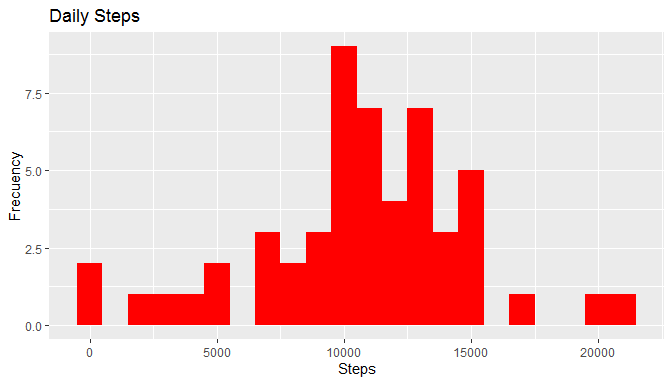
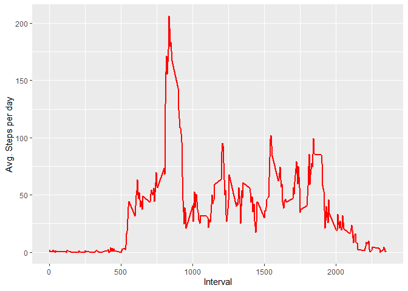
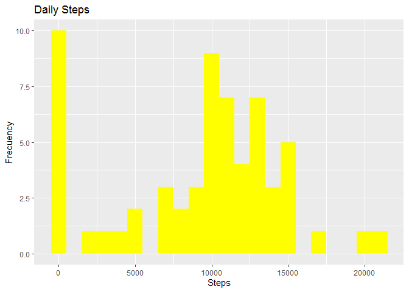
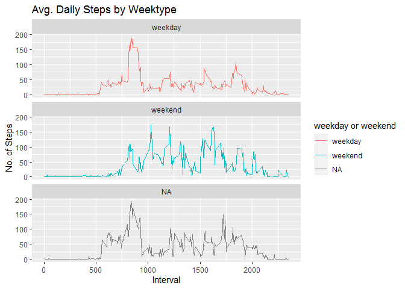

## Loading and preprocessing the data


```r
library(data.table)
library(ggplot2)
library(dplyr)
```

```
## 
## Attaching package: 'dplyr'
```

```
## The following objects are masked from 'package:data.table':
## 
##     between, first, last
```

```
## The following objects are masked from 'package:stats':
## 
##     filter, lag
```

```
## The following objects are masked from 'package:base':
## 
##     intersect, setdiff, setequal, union
```

```r
url <- "https://d396qusza40orc.cloudfront.net/repdata%2Fdata%2Factivity.zip"

download.file(url,destfile = paste0(getwd(),'/repdata%2Fdata%2Factivity.zip'))

unzip("repdata%2Fdata%2Factivity.zip",exdir="unzip")
```

## Code for reading in the dataset and/or processing the data


```r
activity <- data.table::fread("unzip/activity.csv") 
```


## What is mean total number of steps taken per day?

1. Total number of steps by day


```r
steps <- activity[,lapply(.SD, sum,na.rm=F),.SDcols=c("steps"),by=c("date")]

head(steps)
```

```
##          date steps
## 1: 2012-10-01    NA
## 2: 2012-10-02   126
## 3: 2012-10-03 11352
## 4: 2012-10-04 12116
## 5: 2012-10-05 13294
## 6: 2012-10-06 15420
```
2. Histogram of the total number of steps taken each day


```r
graphic1 <- steps %>% 
    ggplot(aes(x=steps))+
    geom_histogram(fill="red",binwidth = 1000)+
    labs(title="Daily Steps",x="Steps",y="Frecuency")
print(graphic1)
```

```
## Warning: Removed 8 rows containing non-finite values (stat_bin).
```

<!-- -->

3. Mean and median number of steps taken each day


```r
steps_mean <- steps[,lapply(.SD, mean,na.rm=TRUE),.SDcols=c("steps")]

steps_median <- steps[,lapply(.SD, median,na.rm=TRUE),.SDcols=c("steps")]

cbind(steps_mean,steps_median)
```

```
##       steps steps
## 1: 10766.19 10765
```

## What is the average daily activity pattern?

1. Time series plot of the average number of steps taken


```r
steps2 <- activity[,lapply(.SD, mean, na.rm=TRUE),.SDcols=c("steps"),by=c("interval")]

steps2 %>% 
    ggplot(aes(x=interval,y=steps))+
    geom_line(color="red",size=1)+
    labs(tittle="Avg. Daily Steps", x= "Interval",
         y="Avg. Steps per day")
```

<!-- -->

2. The 5-minute interval that, on average, contains the maximum number of steps


```r
steps2[steps==max(steps2$steps),.(max_interval=interval)]
```

```
##    max_interval
## 1:          835
```

## Imputing missing values

1. Identify missing values


```r
activity[is.na(steps),.N]
```

```
## [1] 2304
```
2. Replace missing values with median of dataset


```r
activity[is.na(steps),"steps"] <- activity[,c(lapply(.SD, median,na.rm=TRUE)),.SDcols=c("steps")]

head(activity)
```

```
##    steps       date interval
## 1:     0 2012-10-01        0
## 2:     0 2012-10-01        5
## 3:     0 2012-10-01       10
## 4:     0 2012-10-01       15
## 5:     0 2012-10-01       20
## 6:     0 2012-10-01       25
```

3. Histogram of the total number of steps taken each day after missing values are imputed


```r
steps <- activity[,lapply(.SD, sum,na.rm=F),.SDcols=c("steps"),by=c("date")]
steps %>% 
    ggplot(aes(x=steps))+
    geom_histogram(fill="yellow",binwidth = 1000)+
    labs(title="Daily Steps",x="Steps",y="Frecuency")
```

<!-- -->

## Are there differences in activity patterns between weekdays and weekends?


```r
activity <- data.table::fread("unzip/activity.csv")
activity[,date:=as.POSIXct(date,format="%Y-%m-%d")]
activity[,"Day of Week":=weekdays(date)]
activity[grepl(pattern = "lunes|martes|miercoles|jueves|viernes", x = `Day of Week`), "weekday or weekend"] <- "weekday"
activity[grepl(pattern = "sabado|domingo", x = `Day of Week`), "weekday or weekend"] <- "weekend"
activity[, `weekday or weekend` := as.factor(`weekday or weekend`)]
head(activity,10)
```

```
##     steps       date interval Day of Week weekday or weekend
##  1:    NA 2012-10-01        0       lunes            weekday
##  2:    NA 2012-10-01        5       lunes            weekday
##  3:    NA 2012-10-01       10       lunes            weekday
##  4:    NA 2012-10-01       15       lunes            weekday
##  5:    NA 2012-10-01       20       lunes            weekday
##  6:    NA 2012-10-01       25       lunes            weekday
##  7:    NA 2012-10-01       30       lunes            weekday
##  8:    NA 2012-10-01       35       lunes            weekday
##  9:    NA 2012-10-01       40       lunes            weekday
## 10:    NA 2012-10-01       45       lunes            weekday
```
6. Panel plot comparing the average number of steps taken per 5-minute interval across weekdays and weekends


```r
activity[is.na(steps), "steps"] <- activity[, c(lapply(.SD, median, na.rm = TRUE)), .SDcols = c("steps")]

Interval <- activity[, c(lapply(.SD, mean, na.rm = TRUE)), .SDcols = c("steps"), by = .(interval, `weekday or weekend`)] 

library(ggplot2)
ggplot(Interval , aes(x = interval , y = steps, color=`weekday or weekend`)) + geom_line() + labs(title = "Avg. Daily Steps by Weektype", x = "Interval", y = "No. of Steps") + facet_wrap(~`weekday or weekend` , ncol = 1, nrow=3)
```

<!-- -->
